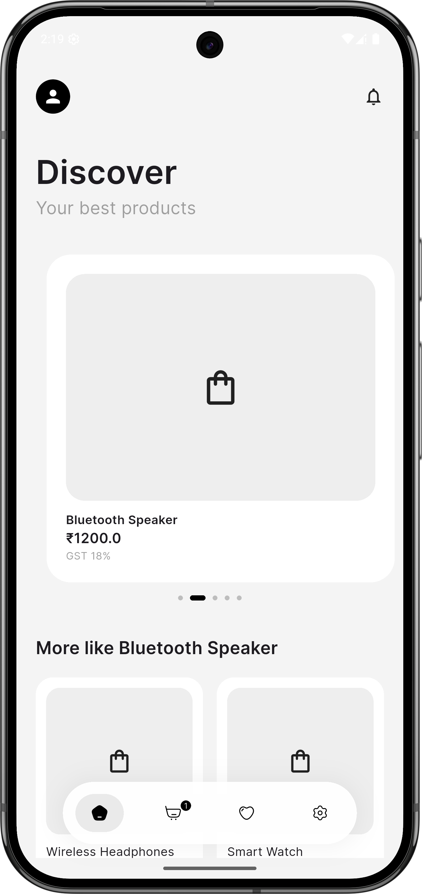
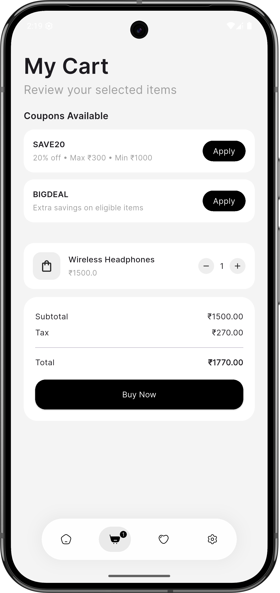
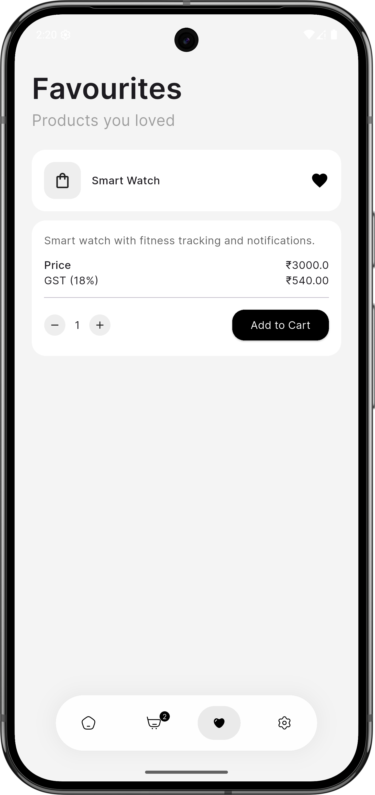
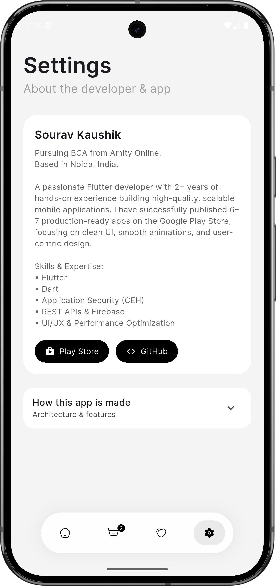

# 🛍️ Shopping App (Flutter)

A minimal and smooth Flutter eCommerce app focused on **clean UI**, **simple architecture**, and **practical shopping features**.

This project demonstrates how a modern shopping app can be built **without heavy state management**, keeping the codebase lightweight, readable, and easy to scale.

---

## 🎯 Purpose

- Practice real-world eCommerce logic
- Maintain a clean and minimal UI
- Use simple, scalable architecture
- Handle local persistence without complexity

---

## ⚙️ How the App Works

### 🏠 Home
- Displays products using a smooth carousel and grid layout
- Shows discounted and non-discounted items
- Tap on a product to open its detail page

### 📦 Product Detail
- Expandable product description (Read more / Read less)
- Tax breakdown and final price calculation
- Add to cart or instant buy
- Subtle animations and user feedback

### 🛒 Cart
- Stores product IDs with quantities (no duplicates)
- Automatically updates totals when quantity changes
- Coupon logic includes:
    - Minimum cart value
    - Maximum discount limit
    - Coupons excluded for discounted items
- Cart data persists even after app restart

### ❤️ Favourites
- Add or remove favourites from anywhere in the app
- Favourite state stays synced across all screens
- Stored locally and restored on restart
- Products can be previewed and added directly to cart

### ⚙️ Settings
- Developer information
- Expandable **“How this app is made”** section
- Inline layout without extra navigation

### 🚀 Onboarding
- Minimal splash screen
- Swipeable onboarding text with indicators
- Smooth transition to Home screen

---

## 🧠 Architecture

- Flutter with Material UI
- Manager-based structure:
    - `CartManager`
    - `FavouriteManager`
    - `ThemeManager`
- `SharedPreferences` for local persistence
- No third-party state management libraries

This approach keeps the app **simple, readable, and scalable**.

---

## 🎨 UI Design

- Minimal color palette
- Rounded components
- Clean typography (Google Fonts – **Inter**)
- Smooth, subtle animations
- Fully responsive on all screen sizes

---

## 📸 Screenshots

| Home | Cart | Favourites | Settings |
|------|------|------------|----------|
|  |  |  |  |

> Make sure these images exist in `assets/screens/` and are committed to the repository.

---

## 🛠️ Tech Stack

- Flutter
- Dart
- Google Fonts
- SharedPreferences

---

## ▶️ Run the App

```bash
flutter pub get
flutter run
